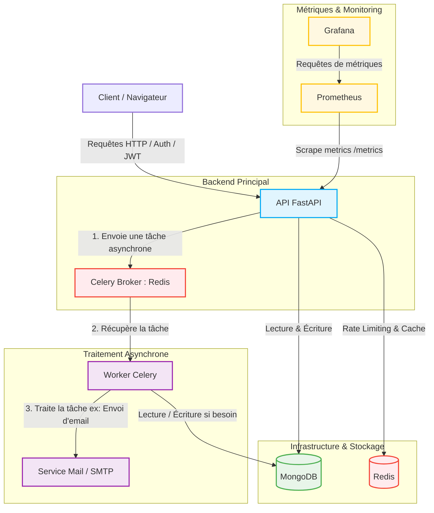

# Base FastAPI

Base de projet FastAPI prête pour la production, construite selon les principes de la Clean Architecture.

Cette architecture intègre :

* FastAPI
* MongoDB (Motor)
* Redis
* Celery pour les tâches asynchrones
* Authentification JWT (Access Token & Refresh Token)
* Monitoring avec Prometheus et Grafana
* Conteneurisation avec Docker

---

# Architecture du Projet

La description détaillée de l'architecture est disponible dans le document suivant :

* [ARCHITECTURE.md](./ARCHITECTURE.md)

### Schéma de l'Architecture & Flux des Tâches



---

# Prérequis

Avant de commencer, assurez-vous que les outils suivants sont installés :

* Python 3.12 ou supérieur
* Docker
* Docker Compose

Pour une exécution sans Docker, vous devez également disposer de :

* MongoDB
* Redis

---

# Installation et Configuration

## 1. Cloner le dépôt

```bash
git clone <repository-url>
cd base-fastapi
```

## 2. Créer le fichier d'environnement

Copiez le fichier d'exemple :

```bash
cp .env.example .env
```

## 3. Configurer les variables d'environnement

Ouvrez le fichier `.env` puis adaptez les valeurs à votre environnement.

### Exécution avec Docker

Conservez les valeurs par défaut :

```env
MONGODB_URI=mongodb://mongo:27017
REDIS_URL=redis://redis:6379
```

### Exécution locale

Remplacez les adresses des conteneurs par celles de votre machine :

```env
MONGODB_URI=mongodb://localhost:27017
REDIS_URL=redis://localhost:6379
```

---

# Démarrage avec Docker (Recommandé)

Cette méthode démarre l'ensemble de l'infrastructure :

* API FastAPI
* MongoDB
* Redis
* Worker Celery
* Prometheus
* Grafana

## Mode Développement

Lance les services avec rechargement automatique du code.

```bash
make dev
```

## Mode Production

Lance les services en arrière-plan avec les configurations de production.

```bash
make prod
```

## Arrêter les services

```bash
make stop
```

---

# Démarrage Local (Sans Docker)

Cette méthode nécessite que MongoDB et Redis soient déjà démarrés sur votre machine.

## 1. Créer un environnement virtuel

Linux / macOS :

```bash
python3 -m venv .venv
source .venv/bin/activate
```

Windows :

```powershell
python -m venv .venv
.venv\Scripts\activate
```

## 2. Installer les dépendances

```bash
pip install -r requirements.txt
```

## 3. Démarrer l'API

```bash
uvicorn app.main:app --host 0.0.0.0 --port 8000 --reload
```

L'application sera accessible à l'adresse :

```text
http://localhost:8000
```

Documentation Swagger :

```text
http://localhost:8000/docs
```

Documentation ReDoc :

```text
http://localhost:8000/redoc
```

## 4. Démarrer le Worker Celery

Dans un second terminal :

```bash
celery -A app.tasks.celery_app.celery_app worker --loglevel=info
```

Si Celery n'est pas encore installé :

```bash
pip install "celery[redis]"
```

---

# Monitoring

## Prometheus

Prometheus collecte les métriques exposées par l'application via l'endpoint :

```text
/metrics
```

Interface :

```text
http://localhost:9090
```

## Grafana

Grafana permet de visualiser les métriques à travers des tableaux de bord préconfigurés.

Interface :

```text
http://localhost:3000
```

Identifiants par défaut :

```text
Username: admin
Password: admin
```

---

# Exécution des Tests

## Avec Docker

Si l'infrastructure est démarrée avec Docker :

```bash
make test
```

## En local

Depuis l'environnement virtuel activé :

```bash
pytest
```

---

# Structure des Services

| Service    | Description                      |
| ---------- | -------------------------------- |
| FastAPI    | API principale                   |
| MongoDB    | Base de données                  |
| Redis      | Cache et broker de messages      |
| Celery     | Exécution des tâches asynchrones |
| Prometheus | Collecte des métriques           |
| Grafana    | Visualisation des métriques      |

---

# Flux de Démarrage Recommandé

Pour démarrer rapidement le projet :

```bash
cp .env.example .env
make dev
```

Puis accéder aux interfaces :

| Service    | URL                         |
| ---------- | --------------------------- |
| API        | http://localhost:8000       |
| Swagger    | http://localhost:8000/docs  |
| ReDoc      | http://localhost:8000/redoc |
| Prometheus | http://localhost:9090       |
| Grafana    | http://localhost:3000       |
|            |                             |
